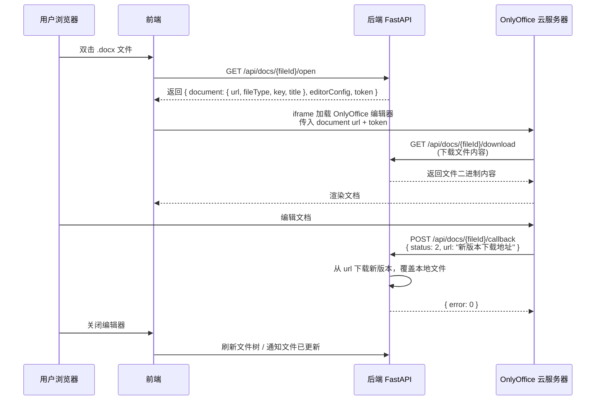

# AI Novelist - 文档支持功能完整计划

## 1. 总体架构

```
┌─ 云服务器 ────────────────────────────────────┐
│  OnlyOffice Document Server (Docker)            │
│  Port: 8080                                     │
│  角色: 文档渲染/编辑引擎，无状态，不存文件        │
└──────────────┬──────────────────────────────────┘
               ↕ HTTP (回调 + iframe)
┌─ 用户本地 ─────────────────────────────────────┐
│  ┌─ 前端 ──────────────────────────────────┐   │
│  │  Monaco Editor     ← 代码/文本文件       │   │
│  │  OnlyOffice iframe ← Office文档文件      │   │
│  │  根据文件扩展名自动切换编辑器             │   │
│  └──────────────────────────────────────────┘   │
│  ┌─ 后端 (FastAPI) ────────────────────────┐   │
│  │  /api/files/    ← 文件增删查改           │   │
│  │  /api/docs/     ← OnlyOffice 回调       │   │
│  │  /api/chat2/    ← Files API 集成        │   │
│  └──────────────────────────────────────────┘   │
│  ┌─ 存储 ──────────────────────────────────┐   │
│  │  本地文件系统 (项目目录内)                │   │
│  │  文件即源，OnlyOffice 用完即焚            │   │
│  └──────────────────────────────────────────┘   │
└─────────────────────────────────────────────────┘
```

## 2. 阶段一：OnlyOffice 基础设施

### 2.1 云服务器部署

```yaml
# docker-compose.yml (部署在云服务器)
version: '3.8'
services:
  onlyoffice-documentserver:
    image: onlyoffice/documentserver:latest
    ports:
      - "8080:80"
    environment:
      - JWT_SECRET=your-jwt-secret-key   # 安全密钥，前后端验证用
      - WOPI_ENABLED=true               # 启用 WOPI 协议
    volumes:
      - onlyoffice_data:/var/www/onlyoffice/Data
    restart: always

volumes:
  onlyoffice_data:
```

**部署命令**:
```bash
docker compose up -d
```

### 2.2 后端：配置项新增

在 [`settings.py`](backend/settings/settings.py) 中增加 OnlyOffice 相关配置：

```python
# OnlyOffice 配置
self.ONLYOFFICE_DOCUMENT_SERVER_URL: str = self.get_config(
    "onlyoffice", "document_server_url", 
    default="http://your-server:8080"
)
self.ONLYOFFICE_JWT_SECRET: str = self.get_config(
    "onlyoffice", "jwt_secret",
    default=""
)
```

### 2.3 后端：文档回调 API

新建 [`backend/api/doc_api.py`]，提供 OnlyOffice 需要的回调接口。

OnlyOffice 编辑流程：



#### 后端 API 设计

| 方法 | 路径 | 说明 |
|------|------|------|
| `GET` | `/api/docs/{fileId}/open` | 获取 OnlyOffice 编辑器配置，返回文件下载 URL 和 token |
| `GET` | `/api/docs/{fileId}/download` | OnlyOffice 调用，下载文件内容（受 JWT 保护） |
| `POST` | `/api/docs/{fileId}/callback` | OnlyOffice 调用，保存编辑后的文件（受 JWT 保护） |

### 2.4 前端：OnlyOffice 编辑器组件

新建 [`frontend/src/components/editor/editor/OfficeEditor.tsx`]

```tsx
interface OfficeEditorProps {
  filePath: string;       // 文件路径
  onClose: () => void;    // 关闭回调
}

// 核心逻辑：
// 1. 调用 GET /api/docs/{encoded_path}/open 获取配置
// 2. 在 iframe 中加载 OnlyOffice 编辑器
// 3. 监听关闭事件
```

使用 [OnlyOffice 文档嵌入 API](https://api.onlyoffice.com/docs/docs-api/additional-api/)：

```javascript
new DocsAPI.DocEditor("iframeContainer", {
  document: {
    url: "http://localhost:8000/api/docs/file.docx/download",
    fileType: "docx",
    key: "unique-key-for-caching",
    title: "file.docx",
  },
  editorConfig: {
    callbackUrl: "http://localhost:8000/api/docs/file.docx/callback",
    lang: "zh-CN",
    user: { id: "user-id", name: "用户名" },
    customization: {
      autosave: true,
      forcesave: true,
    },
  },
  token: "jwt-token",   // 由后端生成，保护所有 OnlyOffice 请求
});
```

### 2.5 前端：编辑器切换逻辑

修改 [`EditorArea.tsx`](frontend/src/components/editor/editor/EditorArea.tsx:46-52)：

```tsx
// 文件类型 → 编辑器 映射表
const EDITOR_MAP: Record<string, 'monaco' | 'onlyoffice'> = {
  // Monaco 负责
  'txt': 'monaco', 'md': 'monaco', 'json': 'monaco',
  'js': 'monaco', 'ts': 'monaco', 'py': 'monaco',
  'html': 'monaco', 'css': 'monaco', 'xml': 'monaco',
  'yaml': 'monaco', 'yml': 'monaco', 'toml': 'monaco',
  'sh': 'monaco', 'ps1': 'monaco', 'bat': 'monaco',
  'env': 'monaco', 'gitignore': 'monaco',
  // OnlyOffice 负责
  'docx': 'onlyoffice', 'doc': 'onlyoffice',
  'xlsx': 'onlyoffice', 'xls': 'onlyoffice',
  'pptx': 'onlyoffice', 'ppt': 'onlyoffice',
  // 图片用原生
  'png': 'image', 'jpg': 'image', 'jpeg': 'image',
  'gif': 'image', 'svg': 'image', 'webp': 'image',
  // PDF 预览
  'pdf': 'pdf',
};

const getEditorType = (filename: string): 'monaco' | 'onlyoffice' | 'image' | 'pdf' => {
  const ext = filename.split('.').pop()?.toLowerCase() || '';
  return EDITOR_MAP[ext] || 'monaco';  // 未知后缀默认 Monaco
};
```

编辑区域渲染逻辑改为：

```tsx
{editorType === 'monaco' && <MonacoEditor ... />}
{editorType === 'onlyoffice' && <OfficeEditor filePath={activeTab} />}
{editorType === 'image' && <ImageViewer filePath={activeTab} />}
{editorType === 'pdf' && <PDFViewer filePath={activeTab} />}
```

## 3. 阶段二：OpenAI Files API 集成

### 3.1 后端：Files API 上传服务

新建 [`backend/ai_agent/utils/file_upload_service.py`]

```python
class FileUploadService:
    """OpenAI Files API 上传服务"""
    
    async def upload_file(self, file_path: str, provider: str) -> str:
        """
        上传文件到 OpenAI Files API
        返回 file_id
        """
        # 1. 获取 provider 的 api_key
        api_key = settings.get_provider_key(provider)
        
        # 2. 判断文件类型，选择 purpose
        #    - "vision" 用于图片
        #    - "assistants" 用于文档 (PDF, DOCX 等)
        
        # 3. 调用 OpenAI Files API
        client = OpenAI(api_key=api_key)
        response = client.files.create(
            file=open(file_path, "rb"),
            purpose="assistants"
        )
        return response.id
    
    async def get_file_content(self, file_id: str, provider: str) -> bytes:
        """获取已上传文件的内容"""
        pass
```

### 3.2 后端：聊天消息增强

修改 [`chat_api2.py`](backend/api/chat_api2.py) 中消息构建逻辑：

**修改点 1**: `_resolve_at_attachments` → 判断提供商决定使用哪种附件方式

```python
async def _resolve_doc_attachments(
    user_input: str, 
    provider: str
) -> tuple[list[dict], list[str]]:
    """
    根据提供商类型，决定使用 Files API 还是文本附件
    
    Returns:
        (file_content_parts, text_attachments)
        - file_content_parts: 用于 OpenAI 系的 type:file parts
        - text_attachments: 用于非 OpenAI 系的文本附件
    """
    at_paths = _system_prompt_builder._extract_at_paths(user_input)
    if not at_paths:
        return [], []
    
    # 判断是否支持 file type
    supports_file_api = _supports_file_api(provider)
    
    file_parts = []
    text_attachments = []
    
    for raw_path in at_paths:
        file_path = resolve_file_path(raw_path)
        if not file_path.exists():
            continue
            
        if supports_file_api:
            # OpenAI 系 → 使用 Files API
            file_id = await _upload_to_files_api(file_path, provider)
            file_parts.append({
                "type": "file",
                "file": {
                    "file_id": file_id,
                    "filename": file_path.name
                }
            })
        else:
            # 非 OpenAI 系 → 回退文本方案
            content = await read_file(str(file_path))
            if content:
                text_attachments.append(
                    f"【用户附件 - {file_path.resolve()}】:\n{content}"
                )
    
    return file_parts, text_attachments
```

**修改点 2**: 仅在用户有附件时，将 file parts 插入 messages 的 content array

### 3.3 提供商兼容性矩阵

```typescript
// 哪些提供商支持 type:file
const FILE_API_SUPPORTED_PROVIDERS = [
  'openai',        // GPT-4o, GPT-4o-mini 等
  // 以下待验证:
  // 'azure',       // Azure OpenAI
  // 'openrouter',  // 取决于上游模型
];
```

在 [`chat_api2.py`](backend/api/chat_api2.py) 中新增 `_supports_file_api()` 函数：

```python
def _supports_file_api(provider: str) -> bool:
    """判断当前提供商是否支持 type:file content part"""
    # 只有 OpenAI 原生模型明确支持
    # 其他提供商可能不支持或未验证
    SUPPORTED = {"openai"}
    return provider in SUPPORTED
```

### 3.4 前端：聊天附件 UI

在 [`MessageInputPanel.tsx`](frontend/src/components/chat/MessageInputPanel.tsx) 增加：

1. **拖拽文件到输入框** - 自动解析为 `@路径` 或上传到 Files API
2. **文件选择按钮** - 点击选择文件
3. **附件列表预览** - 在输入框上方显示已附加的文件

```tsx
// 输入框附件状态
interface AttachmentItem {
  id: string;
  name: string;
  path: string;
  type: 'file' | 'image' | 'document';
  size: number;
}

// 附件列表渲染在输入框上方
// 每个附件可点击移除
```

## 4. 文件类型体系

### 4.1 项目支持的文件类型总表

| 类别 | 扩展名 | 编辑器 | AI 附件方式 |
|------|--------|--------|------------|
| 代码 | `.js/.ts/.py/.html/.css` 等 | Monaco | 文本读取 |
| 标记 | `.md/.json/.yaml/.xml` | Monaco | 文本读取 |
| 文本 | `.txt/.env/.gitignore` | Monaco | 文本读取 |
| 文档 | `.docx/.doc` | **OnlyOffice** | Files API / 文本 |
| 表格 | `.xlsx/.xls` | **OnlyOffice** | Files API |
| 演示 | `.pptx/.ppt` | **OnlyOffice** | Files API |
| 图片 | `.png/.jpg/.jpeg/.gif/.svg/.webp` | **原生 Image** | Files API (vision) |
| PDF | `.pdf` | **PDF.js 预览** | Files API |

### 4.2 文件扩展名 → AI 处理方式映射

```python
# backend/ai_agent/utils/file_type_registry.py

FILE_TYPE_REGISTRY = {
    # {ext: (category, ai_process_mode)}
    # ai_process_mode:
    #   "text"     - 直接读取文本
    #   "file_api" - 使用 OpenAI Files API
    #   "image"    - 作为 image_url 发送
    #   "unsupported" - 不支持
    
    ".txt":  ("text", "text"),
    ".md":   ("text", "text"),
    ".py":   ("code", "text"),
    ".js":   ("code", "text"),
    ".json": ("data", "text"),
    
    ".docx": ("document", "file_api"),
    ".doc":  ("document", "file_api"),
    ".xlsx": ("spreadsheet", "file_api"),
    ".pptx": ("presentation", "file_api"),
    ".pdf":  ("document", "file_api"),
    
    ".png":  ("image", "image"),
    ".jpg":  ("image", "image"),
    ".jpeg": ("image", "image"),
    ".gif":  ("image", "image"),
    ".svg":  ("image", "image"),
}
```

## 5. 实施步骤

```mermaid
gantt
    title 文档支持功能实施计划
    dateFormat  YYYY-MM-DD
    section 阶段一: OnlyOffice
    云服务器部署 OnlyOffice Docker   :a1, 1d
    后端文档回调 API                 :a2, after a1, 2d
    前端 OfficeEditor 组件            :a3, after a2, 2d
    编辑器切换逻辑                   :a4, after a3, 1d
    文件类型注册表                   :a5, after a4, 1d
    
    section 阶段二: Files API
    Files API 上传服务               :b1, after a5, 2d
    聊天消息增强（附件检测+判断）     :b2, after b1, 2d
    前端聊天附件 UI                  :b3, after b2, 2d
    提供商兼容性判断                  :b4, after b3, 1d
```

### 具体任务列表

#### 阶段一：OnlyOffice 文档编辑器

- [ ] 1.1 云服务器部署 OnlyOffice Document Server（Docker）
- [ ] 1.2 后端新增 [`backend/api/doc_api.py`] - 文档回调 API（open/download/callback）
- [ ] 1.3 后端新增 `settings.py` 配置项（ONLYOFFICE_DOCUMENT_SERVER_URL、JWT_SECRET）
- [ ] 1.4 前端新建 [`OfficeEditor.tsx`] - OnlyOffice iframe 封装组件
- [ ] 1.5 前端新建 [`ImageViewer.tsx`] - 图片预览组件
- [ ] 1.6 前端新建 [`PDFViewer.tsx`] - PDF 预览组件（基于 pdfjs）
- [ ] 1.7 修改 [`EditorArea.tsx`] - 根据文件类型切换编辑器
- [ ] 1.8 扩展 [`languageMap.ts`] → [`fileTypeRegistry.ts`] - 文件类型注册表

#### 阶段二：OpenAI Files API

- [ ] 2.1 后端新建 [`file_upload_service.py`] - Files API 上传/管理
- [ ] 2.2 后端新增 `_supports_file_api()` 和 `_resolve_doc_attachments()` 到 `chat_api2.py`
- [ ] 2.3 修改 `chat_api2.py` 中消息构建流程以支持 `type:file`
- [ ] 2.4 前端修改 [`MessageInputPanel.tsx`] - 文件拖拽/选择/附件列表
- [ ] 2.5 前端修改 [`MessageDisplayPanel.tsx`] - 附件消息展示

#### 阶段三：文件管理增强

- [ ] 3.1 后端新增文件元数据 API（文件类型/大小/修改时间）
- [ ] 3.2 前端文件树增加图标区分文件类型
- [ ] 3.3 前端文件右键菜单增加"用 OnlyOffice 打开"选项

## 6. 关键设计决策

### 6.1 为什么文件存本地

- 用户的文件即项目文件，管理简单
- 不依赖云服务器的存储
- 离线场景下仍可读取文件内容（虽然不能编辑）
- OnlyOffice 只是渲染引擎，用完即焚

### 6.2 为什么不用 WOPI 协议

OnlyOffice 支持 WOPI（Web Application Open Platform Interface），但 WOPI 要求文件必须通过 URL 可访问。文件存在本地时：
- **方案 A（本计划采用）**：后端提供 download/callback 接口，OnlyOffice 通过 HTTP 读取/写入
- **方案 B（WOPI）**：需要文件有公开可访问的 URL，不适合本地文件
- 最终选择方案 A，由后端作为文件代理

### 6.3 文件编辑并发安全

OnlyOffice 的 callback 机制保证：
- 每次保存时，OnlyOffice 将完整文件内容 POST 到后端 callback URL
- 后端直接覆盖本地文件
- 多人编辑场景下，OnlyOffice 有冲突检测（需要额外配置）

### 6.4 离线容错

- OnlyOffice 不可用时，Office 文件回退到 Monaco 文本模式（只读显示二进制乱码，需提示用户）
- 图片/PDF 等不受 OnlyOffice 影响
- 建议在设置页面增加"OnlyOffice 服务器地址"配置，允许用户禁用

## 7. 风险与注意事项

1. **OnlyOffice 对网络的要求**：用户需要能访问云服务器的 8080 端口
2. **大文件编辑**：OnlyOffice 需要将文件下载到内存中渲染，超大文件（>100MB）可能有性能问题
3. **JWT 安全**：OnlyOffice 请求需 JWT 验证，防止未授权访问
4. **文件编码**：OnlyOffice 保存的 docx 文件可能与原文件略有差异（换行符、格式微调等）
5. **litellm 版本依赖**：当前 `litellm==1.84.0` 已支持 `type:file`，后续升级需验证兼容性
