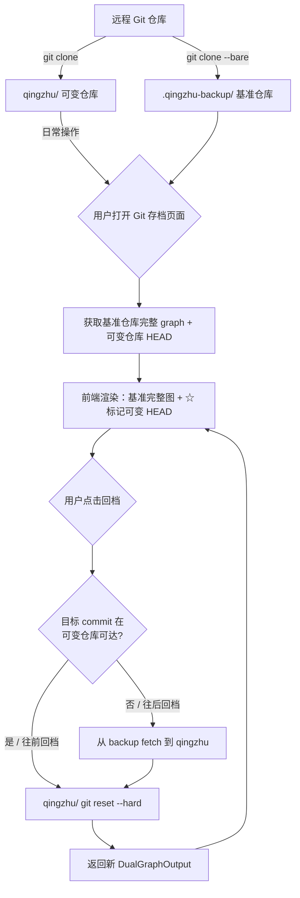
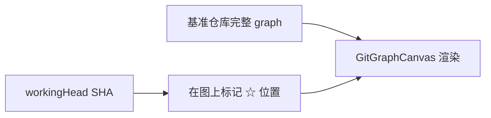

# 双仓库 Git 回档方案设计

## 1. 问题背景

当前回档方案：在 `qingzhu/`（可变仓库）上执行 `git reset --hard <commit>`。问题在于：

- **往前回档**（切到旧 commit）→ 旧 HEAD 之后的 commit 在历史中不可见，用户感知为"丢失"
- 没有备份仓库作为安全网，无法恢复到更新的 commit

## 2. 目录结构

```
启动器.exe 同级目录/
├── qingzhu/                  ← 可变仓库（用户当前工作区，有工作目录）
│   ├── .git/
│   ├── .venv/
│   ├── frontend/
│   └── ...
└── .qingzhu-backup/          ← 基准仓库（bare repo，只存 git 对象）
    ├── HEAD
    ├── objects/
    ├── refs/
    └── packed-refs
```

- **`qingzhu/`** — 用户日常使用的项目目录，后端/前端运行于此
- **`.qingzhu-backup/`** — `git clone --bare`，只作为对象存储，不 checkout 工作目录

## 3. 数据流架构



## 4. 关键变更

### 4.1 渲染方案

**只渲染基准仓库的完整 graph**，然后在图上标记当前可变仓库 HEAD 的位置。不需要双图叠加。



### 4.2 拉取流程变更（`updater.go`）

当前 `cloneProject()` 只 clone 一次到 `qingzhu/`。改为双 clone：

```go
func cloneProject(cfg *Config, logger Logger) error {
    projectDir := GetProjectDir(cfg)          // exe同级/qingzhu
    backupDir := getBackupDir()                // exe同级/.qingzhu-backup

    // 1. clone 到 qingzhu（正常仓库，有工作目录）
    run("git clone <url> <projectDir>")

    // 2. clone --bare 到 .qingzhu-backup（裸仓库，只存对象）
    run("git clone --bare <url> <backupDir>")
}
```

新增 `getBackupDir()`:
```go
func getBackupDir() string {
    exeDir := getExeDir()
    return filepath.Join(exeDir, ".qingzhu-backup")
}
```

`PullUpdates()` 也应同步更新 backup repo：
```go
// 更新时同时 fetch 两个仓库
gitutil.RunIn(projectDir, "fetch", "--prune", "origin")
gitutil.RunIn(backupDir, "fetch", "--prune", "origin")
```

### 4.3 新 Go 类型（`gitman/gitman.go`）

```go
// DualGraphOutput 双仓库分支图输出
// graph: 基准仓库的完整 graph（用于渲染）
// working_head: 可变仓库当前 HEAD SHA（用于在图上标记位置）
type DualGraphOutput struct {
    Graph       *GraphOutput `json:"graph"`        // 基准仓库完整 graph
    WorkingHead string       `json:"working_head"` // 可变仓库当前 HEAD
}
```

### 4.4 新 Wails 方法（`app.go`）

```go
// GitDualGraph 获取基准仓库完整图 + 可变仓库 HEAD 位置
func (a *App) GitDualGraph(maxCount int) (*gitman.DualGraphOutput, error) {
    projectDir := a.getProjectDir()
    backupDir := updater.GetBackupDir()

    graph, err := gitman.GetStructuredGraph(backupDir, maxCount)
    if err != nil {
        return nil, err
    }
    workingHead, err := gitman.GetHeadSHA(projectDir)
    if err != nil {
        return nil, err
    }

    return &DualGraphOutput{
        Graph:       graph,
        WorkingHead: workingHead,
    }, nil
}

// GitDualCheckout 智能回档 + 返回新图
func (a *App) GitDualCheckout(sha string, maxCount int) (*gitman.DualGraphOutput, error) {
    projectDir := a.getProjectDir()
    backupDir := updater.GetBackupDir()

    // 检查目标 commit 是否在可变仓库中可达
    reachable, _ := gitman.IsCommitReachable(projectDir, sha)

    if !reachable {
        // 往后回档 → 先从 backup fetch 到 qingzhu
        if err := gitman.FetchFromRepo(projectDir, backupDir); err != nil {
            return nil, fmt.Errorf("从备份仓库同步失败: %w", err)
        }
    }

    // 执行 reset --hard
    if err := gitman.CheckoutCommit(projectDir, sha); err != nil {
        return nil, fmt.Errorf("回档失败: %w", err)
    }

    // 返回更新后的图
    return a.GitDualGraph(maxCount)
}
```

### 4.5 新增辅助方法（`gitman/gitman.go`）

```go
// IsCommitReachable 检查指定 commit SHA 在当前仓库的对象库中是否存在
func IsCommitReachable(projectDir string, sha string) (bool, error) {
    err := gitutil.RunIn(projectDir, "cat-file", "-e", sha)
    return err == nil, nil
}

// GetHeadSHA 获取当前 HEAD 的完整 SHA
func GetHeadSHA(projectDir string) (string, error) {
    out, err := gitutil.OutputIn(projectDir, "rev-parse", "HEAD")
    return strings.TrimSpace(out), err
}

// FetchFromRepo 从源仓库 fetch 到目标仓库
// 用于从 backup 拉取对象到 qingzhu
func FetchFromRepo(destDir, srcDir string) error {
    return gitutil.RunIn(destDir, "fetch", "--prune", srcDir)
}
```

### 4.6 前端变更

#### 新类型（需 Wails 重新生成绑定后手动补全）

```typescript
// models.ts 新增
export namespace gitman {
    export class DualGraphOutput {
        graph: GraphOutput | null;
        working_head: string;

        static createFrom(source: any = {}) {
            return new DualGraphOutput(source);
        }
        constructor(source: any = {}) {
            if ('string' === typeof source) source = JSON.parse(source);
            this.graph = this.convertValues(source["graph"], GraphOutput);
            this.working_head = source["working_head"];
        }
    }
}

// App.d.ts 新增
export function GitDualGraph(arg1:number): Promise<gitman.DualGraphOutput>;
export function GitDualCheckout(arg1:string, arg2:number): Promise<gitman.DualGraphOutput>;
```

#### `GitGraphCanvas.tsx`

- 接收 `DualGraphOutput` 替代 `GraphOutput`
- 只渲染一份 graph（基准仓库的完整图）
- 在图上找出 SHA 匹配 `workingHead` 的节点，用特殊样式标记（绿色大圆 + 白色描边光环 + "HEAD" 标签）
- 回档按钮不变：点击节点 → 调用 `GitDualCheckout(sha)`

#### `GitManager.tsx`

- 调用 `GitDualGraph` 替代 `GitStructuredGraph`
- 回档调用 `GitDualCheckout` 替代 `GitCheckout`
- 传 `DualGraphOutput` 给 `GitGraphCanvas`

## 5. 修改文件清单

| 文件 | 修改类型 | 说明 |
|------|----------|------|
| `launcher/internal/updater/updater.go` | 新增+修改 | `getBackupDir()`, `cloneProject()` 双 clone, `PullUpdates()` 双 fetch |
| `launcher/internal/gitman/gitman.go` | 新增 | `DualGraphOutput` 类型, `IsCommitReachable()`, `GetHeadSHA()`, `FetchFromRepo()` |
| `launcher/app.go` | 新增 | `GitDualGraph()` Wails 绑定, `GitDualCheckout()` Wails 绑定 |
| Wails 自动生成 | models.ts / App.d.ts / App.js | 新增 `DualGraphOutput` 及方法绑定 |
| `launcher/frontend/src/components/GitGraphCanvas.tsx` | 修改 | 接收 `DualGraphOutput`，标注 workingHead |
| `launcher/frontend/src/components/GitManager.tsx` | 修改 | 调用新 API |

## 6. 执行顺序

1. **Go 后端** — 在 `gitman` 包新增 `DualGraphOutput`、`IsCommitReachable()`、`GetHeadSHA()`、`FetchFromRepo()`
2. **Go 后端** — 修改 `updater.go`：新增 `getBackupDir()`，`cloneProject()` / `PullUpdates()` 中双仓库操作
3. **Go 后端** — 在 `app.go` 新增 `GitDualGraph()` + `GitDualCheckout()` Wails 绑定
4. **Wails 绑定** — `wails generate bindings` 重新生成前端 TypeScript 绑定
5. **前端** — 修改 `GitGraphCanvas` 和 `GitManager` 适配新类型

> 注：无迁移方案。backup 仓库仅在新 clone 或 PullUpdates 时创建。已有安装用户点击"检查更新"后自动创建。

## 7. 边界情况

| 场景 | 处理方式 |
|------|----------|
| backup 仓库尚未创建 | `ensureBackupRepo()` 从本地 clone --bare |
| 回档到当前 HEAD | 直接返回当前图，不做任何操作 |
| 目标 SHA 在 backup 中也不存在 | 返回错误"该提交在备份仓库中也不存在" |
| 可变仓库有未提交的修改 | 当前先忽略（后续可加 stashing） |
| `git fetch` 冲突 | 使用 `--prune` 避免 stale refs |
