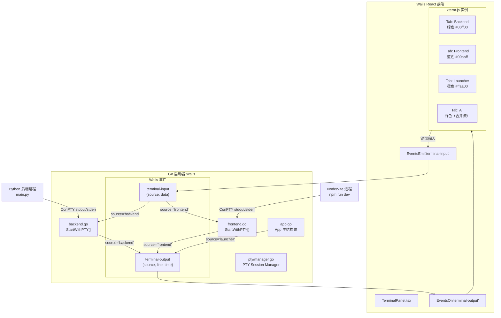
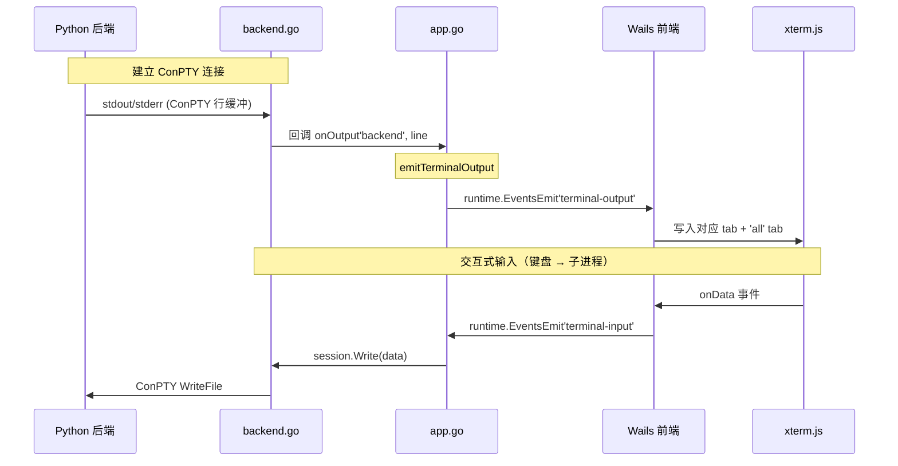

# 启动器 PTY / TUI 改造方案

## 现状

[`launcher/internal/backend/backend.go:69-76`](launcher/internal/backend/backend.go:69) 和 [`launcher/internal/frontend/frontend.go:85-92`](launcher/internal/frontend/frontend.go:85) 均使用 `cmd.StdoutPipe()` / `cmd.StderrPipe()` 接收子进程的输出。

**问题：** OS 管道缓冲区极小（Windows 4KB），Go 端处理不及时时 Python/Node 的 `write()` 会阻塞。

**Phase 1 已做完。** Python 端大日志问题已修复，pipe 阻塞短期不会出现。

---

## 决策：选择方案C — 嵌入式终端模拟器

**已确认采用方案C（混合方案）：** 保留 Wails 壳，在前端嵌入 [xterm.js](https://xtermjs.org/) 终端模拟器。

### 范围扩展

原始方案C仅考虑 Python 后端的日志。用户需求扩展为：

1. **三段日志显示** — 后端(Python)、前端(Vite)、启动器本身(Go) 各自需要终端显示
2. **交互式终端** — 终端不仅是只读日志面板，还需要支持键盘输入（键盘 → ConPTY → 子进程 stdin）
3. **TUI 主界面** — 长期方向：从按钮式交互转向终端 TUI 式交互

| 日志源 | 当前输出路径 | 交互式支持 |
|--------|-------------|-----------|
| **后端** (Python `main.py`) | `backend.go` → `logger.Logf()` → Wails event | ✅ 支持输入 |
| **前端** (Vite dev server) | `frontend.go` → `logger.Logf()` → Wails event | ✅ 支持输入 |
| **启动器本身** (Go) | `App.Logf()` → Wails event | ❌ 只读（启动器自身日志） |

**关键发现：** 三段日志**已经全部流经** [`app.go:345-358`](launcher/app.go:345) 的 `App.Logf()` → `runtime.EventsEmit(a.ctx, "log", line)`。

---

## 架构设计

### 整体架构



### 三段日志流详解



---

## 实现方案

### Step 1：Go 端 — 新增 PTY 管理包 [`launcher/internal/pty/`](launcher/internal/pty/)

新增包，封装 ConPTY 创建和 I/O 逻辑。

**`manager.go`** — PTY Session Manager：

```go
package pty

import (
    "github.com/UserExistsError/conpty"
)

// PTYSession 表示一个伪终端会话
type PTYSession struct {
    con       *conpty.ConPty
    source    string   // "backend" | "frontend"
    onOutput  func(source string, line string)
}

// New 创建 ConPTY，返回会话对象
func New(cols, rows int) (*PTYSession, error)

// Attach 将进程 stdio 重定向到 ConPTY
func (s *PTYSession) Attach(cmd *exec.Cmd) error

// ReadLoop 启动 goroutine 持续读取 ConPTY 输出，通过 onOutput 回调传递
func (s *PTYSession) ReadLoop()

// Write 接收来自前端的键盘输入，写入 ConPTY → 子进程 stdin
func (s *PTYSession) Write(data []byte) (int, error)

// Resize 通知 ConPTY 终端尺寸变化
func (s *PTYSession) Resize(cols, rows int) error

// Close 关闭伪终端
func (s *PTYSession) Close() error
```

### Step 2：Go 端 — 改造 [`backend.go`](launcher/internal/backend/backend.go)

新增 `StartWithPTY()`，接收一个 `onOutput` 回调和 `onInput` 通道，返回 `*pty.PTYSession`。

```go
// StartWithPTY 使用 ConPTY 启动后端进程
func StartWithPTY(projectPath, pythonPath string, onOutput func(string, string)) (*pty.PTYSession, error) {
    mainPy := filepath.Join(projectPath, "main.py")
    
    cpty, err := pty.New(120, 40)
    if err != nil {
        return nil, fmt.Errorf("创建 ConPTY 失败: %w", err)
    }
    
    cmd := exec.Command(pythonPath, mainPy)
    cmd.Dir = projectPath
    cmd.SysProcAttr = &syscall.SysProcAttr{HideWindow: true}
    
    if err := cpty.Attach(cmd); err != nil {
        cpty.Close()
        return nil, err
    }
    
    if err := cmd.Start(); err != nil {
        cpty.Close()
        return nil, err
    }
    
    // 启动读取循环
    cpty.ReadLoop("backend", onOutput)
    
    return cpty, nil
}

// 保留旧 Start() 用于 npm install / pip install 等一次性任务
```

### Step 3：Go 端 — 改造 [`frontend.go`](launcher/internal/frontend/frontend.go)

同上模式，使用 `pty.New()` → `Attach()` → `Start()` → `ReadLoop("frontend", ...)`。

### Step 4：Go 端 — 改造 [`app.go`](launcher/app.go)

**新增结构化事件系统：**

```go
// 发送终端输出事件（Go → 前端）
func (a *App) emitTerminalOutput(source string, line string) {
    if a.ctx != nil {
        runtime.EventsEmit(a.ctx, "terminal-output", map[string]string{
            "source": source,
            "line":   line,
            "time":   time.Now().Format("15:04:05"),
        })
    }
}

// 接收终端输入事件（前端 → Go）
func (a *App) listenTerminalInput() {
    runtime.EventsOn(a.ctx, "terminal-input", func(data map[string]interface{}) {
        source := data["source"].(string)
        input  := data["data"].(string)
        
        switch source {
        case "backend":
            if a.backendPTY != nil {
                a.backendPTY.Write([]byte(input))
            }
        case "frontend":
            if a.frontendPTY != nil {
                a.frontendPTY.Write([]byte(input))
            }
        }
    })
}
```

**改造 BackendStart/FrontendStart：**

```go
// App 结构体新增字段
type App struct {
    // ... 现有字段 ...
    backendPTY  *pty.PTYSession
    frontendPTY *pty.PTYSession
}

func (a *App) BackendStart() error {
    // ... (现有 Python 检测逻辑不变) ...
    
    // 改为使用 StartWithPTY
    session, err := backend.StartWithPTY(projectDir, pythonPath, a.emitTerminalOutput)
    if err != nil {
        return err
    }
    a.backendPTY = session
    a.cmdBackend = ... // 从 session 获取 Process
    return nil
}

// 启动器自身日志改为带 source 标签
func (a *App) Logf(format string, args ...interface{}) {
    line := fmt.Sprintf(format, args...)
    // ... (现有 buffer 逻辑不变) ...
    a.emitTerminalOutput("launcher", line) // 新增
}
```

### Step 5：Go 端 — PTY 尺寸同步

前端 xterm.js 窗口尺寸变化时，通知 Go 端同步 ConPTY 尺寸：

```go
// app.go
runtime.EventsOn(a.ctx, "terminal-resize", func(data map[string]interface{}) {
    source := data["source"].(string)
    cols   := int(data["cols"].(float64))
    rows   := int(data["rows"].(float64))
    
    switch source {
    case "backend":
        if a.backendPTY != nil { a.backendPTY.Resize(cols, rows) }
    case "frontend":
        if a.frontendPTY != nil { a.frontendPTY.Resize(cols, rows) }
    }
})
```

### Step 6：前端 — xterm.js 终端面板

**安装依赖：**

```bash
cd launcher/frontend
npm install @xterm/xterm @xterm/addon-fit
```

**新建 [`launcher/frontend/src/components/TerminalPanel.tsx`](launcher/frontend/src/components/TerminalPanel.tsx)：**

基于 [`notes/terminal/TerminalPanel.tsx`](notes/terminal/TerminalPanel.tsx) 改造，适配 Wails 事件系统：

| 项目 | Electron 版（notes） | Wails 版（新） |
|------|-------------------|--------------|
| 事件监听 | `window.electron.terminal.on(...)` | `import { EventsOn } from '../wailsjs/runtime'` |
| 事件发送 | `window.electron.terminal.invoke(...)` | `import { EventsEmit } from '../wailsjs/runtime'` |
| 事件名 | `terminal:data:{id}` | `terminal-output` |
| 输入事件 | `terminal:write` | `terminal-input` |
| 尺寸同步 | `terminal:resize` | `terminal-resize` |
| 终端创建 | 后端 node-pty 进程 | Go ConPTY session（已存在） |

**核心逻辑伪代码：**

```tsx
interface TerminalTab {
  id: 'backend' | 'frontend' | 'launcher' | 'all';
  label: string;
  color: string;
  term: Terminal;
  fitAddon: FitAddon;
}

function TerminalPanel() {
  const tabs: TerminalTab[] = [
    { id: 'all',      label: '全部',    color: '#ffffff', ... },
    { id: 'backend',  label: '后端',    color: '#00ff00', ... },
    { id: 'frontend', label: '前端',    color: '#00aaff', ... },
    { id: 'launcher', label: '启动器',  color: '#ffaa00', ... },
  ];
  
  const [activeTab, setActiveTab] = useState('all');
  const inputBuffer = useRef<Map<string, string>>(new Map());

  useEffect(() => {
    // 监听后端输出
    EventsOn('terminal-output', (data: { source: string; line: string }) => {
      tabs.forEach(tab => {
        if (tab.id === 'all' || tab.id === data.source) {
          tab.term.writeln(data.line);
        }
      });
    });
  }, []);

  // 键盘输入处理
  const handleTerminalInput = (data: string) => {
    // 只对 backend / frontend tab 发送输入
    if (activeTab !== 'launcher' && activeTab !== 'all') {
      EventsEmit('terminal-input', { source: activeTab, data });
    }
    // 'all' tab 下需要额外逻辑确定发往哪个 source
  };

  return (
    <div className="terminal-panel">
      <div className="tab-bar">
        {tabs.map(tab => (
          <button onClick={() => setActiveTab(tab.id)}>
            {tab.label}
          </button>
        ))}
      </div>
      <div className="terminal-container">
        <TerminalView tab={activeTab} onData={handleTerminalInput} />
      </div>
    </div>
  );
}
```

### Step 7：前端 — 布局集成

在 [`launcher/frontend/src/App.tsx`](launcher/frontend/src/App.tsx) 中集成 TerminalPanel。

**渐进式 TUI 过渡布局：**

```
Phase 2a (当前按钮式 + 终端面板)
┌──────────────────────────────────────────┐
│  [检查更新] [启动后端] [启动前端] [停止]  │  ← 现有按钮
├──────────────────────────────────────────┤
│  ┌─全部──后端──前端──启动器─────────────┐│
│  │                                       ││
│  │  [后端] 服务已启动 (PID: 1234)        ││  ← xterm.js
│  │  [前端] Vite dev server ready...      ││
│  │  [启动器] 等待后端就绪...              ││
│  │                                       ││
│  └───────────────────────────────────────┘│
└──────────────────────────────────────────┘

Phase 2b (TUI 过渡：终端面板为主)
┌──────────────────────────────────────────┐
│  ┌─全部──后端──前端──启动器─────────────┐│
│  │                                       ││
│  │  $ backend status                     ││  ← 用户在终端输入命令
│  │  ✅ 后端运行中 (PID: 1234)            ││
│  │  $ frontend status                    ││
│  │  ✅ 前端运行中 (PID: 5678)            ││
│  │  $ git log --oneline -5               ││
│  │  a1b2c3d fix: ...                     ││
│  │                                       ││
│  └───────────────────────────────────────┘│
└──────────────────────────────────────────┘
```

**关键交互设计：**

1. **`all` tab** — 合并流，只读（无法确定输入发往哪个 source）
2. **`backend` tab** — 显示 Python 输出，键盘输入发往 Python stdin
3. **`frontend` tab** — 显示 Vite 输出，键盘输入发往 Vite stdin
4. **`launcher` tab** — 只读，显示启动器自身日志
5. 支持快捷键 `Ctrl+Tab` 切换 tab
6. 支持 `Ctrl+C` 复制选中文本，`Ctrl+V` 或 `Shift+Insert` 粘贴
7. 面板高度可拖拽调整，支持折叠

### Step 8：残留的按钮式交互迁移到 TUI

当前按钮功能（在 [`app.go`](launcher/app.go) 中）需要转换为可通过终端命令调用的形式：

| 当前按钮 | 对应方法 | TUI 命令构想 |
|---------|---------|------------|
| 检查更新 | `App.CheckUpdate()` | `update check` |
| 下载更新 | `App.PerformUpdate()` | `update install` |
| 准备环境 | `App.PrepareEnvironment()` | `setup` |
| 启动后端 | `App.BackendStart()` | `backend start` |
| 停止后端 | `App.BackendStop()` | `backend stop` |
| 启动前端 | `App.FrontendStart()` | `frontend start` |
| 停止前端 | `App.FrontendStop()` | `frontend stop` |
| Git 历史 | `App.GitHistory()` | `git log` |
| 切换分支 | `App.GitSwitchBranch()` | `git switch <branch>` |

**实现方式：**

Go 端新增一个 `TUICommandHandler`，注册命令路由：

```go
// launcher/internal/tui/handler.go
type Handler struct {
    app *App
    cmds map[string]func(args []string) string
}

func NewHandler(app *App) *Handler {
    h := &Handler{app: app}
    h.cmds = map[string]func(args []string) string{
        "backend":   h.handleBackend,
        "frontend":  h.handleFrontend,
        "update":    h.handleUpdate,
        "setup":     h.handleSetup,
        "git":       h.handleGit,
        "help":      h.handleHelp,
    }
    return h
}

// 接收前端发来的命令字符串，执行并返回结果文本
func (h *Handler) Execute(cmdLine string) string {
    parts := strings.Fields(cmdLine)
    if len(parts) == 0 { return "" }
    
    if handler, ok := h.cmds[parts[0]]; ok {
        return handler(parts[1:])
    }
    return fmt.Sprintf("未知命令: %s，输入 help 查看可用命令", parts[0])
}
```

前端 `all` tab（或专用的 `cli` tab）中，用户输入的命令通过 `terminal-input` 事件发给 `cli` source，Go 端 `TUICommandHandler` 处理并返回文本结果。

---

## 推荐路线

```
Phase 1 (已完成) → Phase 2a → Phase 2b → Phase 3
  修 Python 日志      ConPTY +          TUI 命令        纯 TUI 启动器
  ✅ 已做完           xterm.js 日志     交互式终端       可选：抛弃 Wails
                     只读显示           命令路由          转 Bubble Tea
```

### Phase 2a — 嵌入式终端日志显示（当前）

| # | 任务 | 涉及文件 |
|---|------|---------|
| 1 | 新增 `pty/` 包，封装 ConPTY 创建与 I/O | `launcher/internal/pty/manager.go` |
| 2 | 改造 `backend.go`，新增 `StartWithPTY()` | `launcher/internal/backend/backend.go` |
| 3 | 改造 `frontend.go`，新增 `StartWithPTY()` | `launcher/internal/frontend/frontend.go` |
| 4 | 改造 `app.go`，新增结构化日志事件 + 输入监听 | `launcher/app.go` |
| 5 | 安装 xterm.js 依赖 | `launcher/frontend/package.json` |
| 6 | 实现 `TerminalPanel.tsx`（4 tab + 终端渲染） | `launcher/frontend/src/components/TerminalPanel.tsx` |
| 7 | 集成到 `App.tsx` 布局 | `launcher/frontend/src/App.tsx` |
| 8 | PTY 尺寸同步（前端 resize → ConPTY resize） | `TerminalPanel.tsx` + `app.go` |
| 9 | 保留降级：ConPTY 不可用时自动回落为 pipe | `pty/manager.go` |

### Phase 2b — TUI 命令模式

| # | 任务 | 涉及文件 |
|---|------|---------|
| 10 | 新增 `tui/` 包，实现命令路由 | `launcher/internal/tui/handler.go` |
| 11 | 注册命令：backend/frontend/update/setup/git/help | `launcher/internal/tui/handler.go` |
| 12 | 前端 `cli` tab（或集成到 `all` tab）支持命令输入 | `TerminalPanel.tsx` |
| 13 | 逐步替换按钮 UI 为终端命令 | `App.tsx` → 逐步移除按钮 |
| 14 | 添加命令自动补全 / 历史记录 | `TerminalPanel.tsx` |

### Phase 3（远期可选）— 纯 TUI 启动器

如果 Wails Webview 不再是必需，可以用 [Bubble Tea](https://github.com/charmbracelet/bubbletea) 重写：

- 单二进制分发包，无 Web 依赖
- 原生支持 tty 设备
- 可做真正的 TUI：进度条、日志面板、Git 分支图

**但注意：** 这会丢失 Wails 的 Webview 标签页功能（`open-webview-tab`），且需要完全重写前端。

---

## 降级策略

Windows 10 v1809（Build 17763）以下不支持 ConPTY。

```go
func isConPTYSupported() bool {
    major, minor, build := windowsVersion()
    return major >= 10 && build >= 17763
}
```

**降级行为：**
- ConPTY 不可用 → 自动回落为当前 pipe 方案
- 前端 terminal panel 仍然通过 Wails event 接收日志（只读）
- 交互式输入功能自动禁用（`launcher` tab 保持只读）
- 用户可见提示："当前系统不支持 ConPTY，终端为只读模式"
