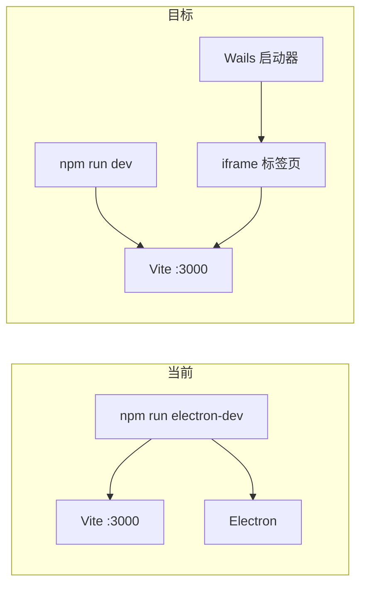

# 用 Wails 替代 Electron 方案（最终版）

## 背景

没有打包环境。启动器下的开发环境就是交付给用户的环境。

**启动流程（当前）：**
1. 启动器准备环境（Git/Node/Python/rg）
2. 用户点击"下载启动"
3. Go 启动 Python 后端 → `python main.py`
4. Go 启动前端壳 → `npm run electron-dev`（= Vite + Electron 同时启动）

**启动流程（目标）：**
1. 启动器准备环境（不变）
2. 用户点击"下载启动"
3. Go 启动 Python 后端 → `python main.py`（不变）
4. Go 启动 Vite dev server → `npm run dev`（仅启动 Vite，不再启动 Electron）
5. 启动器新增"主项目"标签页，iframe 加载 `http://localhost:3000`

---

## 改动内容（极小）

### 基本原则
- **所有 Electron 代码保留不动**（废弃作为参考，不删除）
- 只改必须改的几行代码

### 1. 启动器前端：新增标签页

**文件：** [`launcher/frontend/src/App.tsx`](launcher/frontend/src/App.tsx)

- 新增 tab 状态 `'app'`
- 点击后显示 `WebviewTab`，url 指向 `http://localhost:3000`

```tsx
// 标签页切换
const [mainTab, setMainTab] = useState<'main' | 'version' | 'website' | 'app'>('main');
//                                                                     ↑ 新增

// 渲染标签（和已存在的 website 标签类似）
{mainTab === 'app' && (
  <WebviewTab id="main-app" title="青烛" url="http://localhost:3000" />
)}
```

### 2. 前端依赖清理

**文件：** [`frontend/package.json`](frontend/package.json)

删除以下依赖（让 npm install 不再下载 Electron 二进制）：
- `"electron": "^40.6.0"`
- `"electron-builder": "^26.8.1"`
- `"concurrently": "^9.2.1"`
- `"wait-on": "^7.2.0"`
- `"node-pty": "^1.1.0"`（终端废弃）

删除 field：
- `"main": "electron/main.js"`

删除 scripts：
- `"electron-dev"` → 已弃用
- `"build-electron"` → 已弃用

保留 `"dev": "vite"`（原本就有，符合需求）

### 3. 类型与组件——不动

| 文件 | 处理 |
|------|------|
| [`types/electron.d.ts`](frontend/src/types/electron.d.ts) | **保留**，`window.electron` 代码有安全判断，类型定义放着不影响编译 |
| [`WindowControls.tsx`](frontend/src/components/others/WindowControls.tsx) | **不动**，已有 `if (window.electron && ...)` 安全判断，iframe 中静默无操作 |
| [`TerminalPanel.tsx`](frontend/src/components/terminal/TerminalPanel.tsx) | **不动**，已有 `?.` 可选链保护，iframe 中自然不可用 |
| [`frontend/electron/`](frontend/electron/) | **保留全部代码**，不再加载 |

### 4. Go 后端：改造启动逻辑

**文件：** [`launcher/internal/frontend/frontend.go`](launcher/internal/frontend/frontend.go)

原来：
```go
cmd := exec.Command("cmd", "/c", npmPath, "run", "electron-dev")
```

改为：
```go
cmd := exec.Command("cmd", "/c", npmPath, "run", "dev")
```

同时，[`launcher/internal/launcher/launcher.go`](launcher/internal/launcher/launcher.go) 中 `DownloadLaunch()` 里如果有等待 Electron 进程的逻辑，调整去掉了。

### 5. 其他文件

| 文件 | 处理 |
|------|------|
| [`frontend/electron-builder.json`](frontend/electron-builder.json) | **保留**，不动 |
| [`scripts/build-launcher.ps1`](scripts/build-launcher.ps1) | 检查是否引用 `electron-dev`，如有则更新 |

---

## 改动汇总

| # | 改动 | 文件 | 说明 |
|---|------|------|------|
| 1 | 新增一个标签页 | `launcher/frontend/src/App.tsx` | ~5 行 |
| 2 | 删除 Electron 依赖 | `frontend/package.json` | ~10 行，npm install 不再下载 200MB+ |
| 3 | `electron-dev` → `dev` | `launcher/internal/frontend/frontend.go` | ~2 行 |
| 4 | 调整 `DownloadLaunch` | `launcher/internal/launcher/launcher.go` | ~5 行 |
| 5 | 检查构建脚本 | `scripts/build-launcher.ps1` | 可能需要调整 |

**所有 Electron 源码文件保留不动。**

## 流程图


