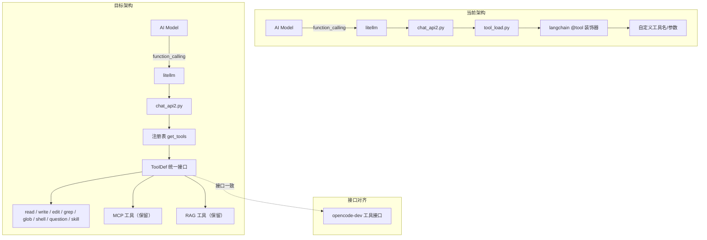

# 工具接口重构计划：与 opencode-dev 接口兼容

## 1. 背景与目标

### 问题
当前 [`ai-novelist`](.) 使用自定义的工具接口（基于 langchain `@tool` 装饰器 + Pydantic schema），工具名称、参数模式均为自创命名。这导致大量主流 AI 模型（如 Claude、GPT、Gemini）无法直接适配——因为这些模型正在为知名项目（如 opencode-dev）做工具调用的原生适配。

### 目标
- **接口层完全对标** [`opencode-dev`](opencode-dev/packages/opencode/src/tool) 的工具接口
- 工具名称、参数 schema、输出格式与 opencode-dev 保持一致
- 具体实现可以自由调整，甚至可以直接复用其逻辑
- 迁移后 AI 模型对工具的"理解成本"趋近于零

---

## 2. opencode-dev 工具接口解剖

### 2.1 核心定义

opencode-dev 使用 **Effect-TS** 的 `Schema` 系统定义工具，核心接口位于 [`tool.ts`](opencode-dev/packages/opencode/src/tool/tool.ts)：

```typescript
// 工具定义
interface Def<Parameters, Metadata> {
  id: string                          // 工具唯一标识
  description: string                 // 工具描述（LLM 会读取）
  parameters: Schema.Decoder          // Effect Schema 参数定义
  jsonSchema?: JSONSchema7            // 可选，用于标注 optional 字段
  execute(args, ctx): Effect<ExecuteResult>
  formatValidationError?(error): string
}

// 执行结果
interface ExecuteResult<Metadata> {
  title: string                       // 简短标题
  metadata: M                         // 结构化元数据
  output: string                      // 文本输出（LLM 可读）
  attachments?: FilePart[]            // 文件附件（图片等）
}

// 执行上下文
interface Context {
  sessionID, messageID, agent
  abort: AbortSignal                  // 取消信号
  callID?: string
  extra?: { [key: string]: unknown }
  messages: MessageV2.WithParts[]
  metadata(input): Effect<void>       // 更新元数据
  ask(input): Effect<void>            // 权限询问
}
```

### 2.2 工具注册机制

注册在 [`registry.ts`](opencode-dev/packages/opencode/src/tool/registry.ts)，通过 `Tool.define(id, init)` + `Tool.init(info)` 完成。每个工具先定义 `Info` 对象，再通过 `init()` 变成可执行的 `Def`。

```typescript
// 定义模式
export const MyTool = Tool.define(
  "tool_id",
  Effect.gen(function* () {
    // 注入依赖
    const fs = yield* AppFileSystem.Service
    return {
      description: DESCRIPTION,       // 来自 .txt 文件
      parameters: Parameters,         // Schema.Struct({...})
      execute: (params, ctx) =>
        Effect.gen(function* () {
          // ... 实现逻辑
          return { title, output, metadata }
        }).pipe(Effect.orDie),
    }
  }),
)
```

### 2.3 向 LLM 暴露的格式

在 [`tool_to_openai_schema()`](backend/api/chat_api2.py:105) 中，当前项目通过 `model_json_schema()` 生成 OpenAI 兼容格式。opencode-dev 通过 `parameters` + `jsonSchema` 输出同样的 `JSONSchema7` 格式，本质上完全兼容。

---

## 3. 工具映射表

### 3.1 核心映射

| 当前工具 (ai-novelist) | 目标工具 (opencode-dev) | 文件 | 说明 |
|---|---|---|---|
| `manage_file` | **`write`** | [`write.ts`](opencode-dev/packages/opencode/src/tool/write.ts) | 创建/覆写文件，参数 `filePath` + `content` |
| `replace_line` | **`edit`** | [`edit.ts`](opencode-dev/packages/opencode/src/tool/edit.ts) | 搜索替换编辑，参数 `filePath` + `oldString` + `newString` |
| `insert_line` | **`edit`**（`oldString=""`） | 同上 | 插入即空字符串替换 |
| `delete_line` | **`edit`**（`newString=""`） | 同上 | 删除即替换为空 |
| `search_text` | **`grep`** | [`grep.ts`](opencode-dev/packages/opencode/src/tool/grep.ts) | 正则搜索，参数 `pattern` + `path` + `include` |
| （无对应） | **`glob`** | [`glob.ts`](opencode-dev/packages/opencode/src/tool/glob.ts) | 文件模式匹配，参数 `pattern` + `path` |
| `load_unload_file` | **`read`** | [`read.ts`](opencode-dev/packages/opencode/src/tool/read.ts) | 读取文件内容，参数 `filePath` + `offset` + `limit` |
| `execute_command` | **`shell`** | [`shell.ts`](opencode-dev/packages/opencode/src/tool/shell.ts) | 执行命令，参数 `command` + `description` + `timeout` + `workdir` |
| `ask_user_question` | **`question`** | [`question.ts`](opencode-dev/packages/opencode/src/tool/question.ts) | 向用户提问，参数 `questions[]` |
| `load_unload_skill` | **`skill`** | [`skill.ts`](opencode-dev/packages/opencode/src/tool/skill.ts) | 加载 Skill，参数 `name` |

### 3.2 需要新增的工具

| 工具 | 文件 | 说明 |
|---|---|---|
| **`task`** | [`task.ts`](opencode-dev/packages/opencode/src/tool/task.ts) | 子代理任务委派，参数 `description` + `prompt` + `subagent_type` |
| **`task_status`** | [`task_status.ts`](opencode-dev/packages/opencode/src/tool/task_status.ts) | 后台任务状态查询 |
| **`apply_patch`** | [`apply_patch.ts`](opencode-dev/packages/opencode/src/tool/apply_patch.ts) | Patch 应用（统一 diff 格式） |
| **`webfetch`** | [`webfetch.ts`](opencode-dev/packages/opencode/src/tool/webfetch.ts) | HTTP 请求 |
| **`websearch`** | [`websearch.ts`](opencode-dev/packages/opencode/src/tool/websearch.ts) | Web 搜索（依赖外部 API） |

### 3.3 保留的自定义工具

| 工具 | 说明 |
|---|---|
| `rag_search` | 项目特有的 RAG 知识库搜索，可保留但改名建议参考下文 |
| `rag_list_files` | 知识库文件列表，同上 |

> **建议**：将 RAG 工具挂到 `mcp--` 前缀下通过 MCP 暴露，或作为"项目级"工具单独注册，不干扰核心工具集。

---

## 4. 重构步骤

### 阶段一：建立基础框架

#### 步骤 1.1 — 定义 Python 版 `Tool` 基类

新建 [`backend/ai_agent/tool/base.py`](backend/ai_agent/tool/base.py)，定义与 opencode-dev 对齐的核心接口：

```python
from dataclasses import dataclass, field
from typing import Any, Callable, Coroutine, Optional
from pydantic import BaseModel

# 参数 schema 用 Pydantic BaseModel 替代 Effect Schema
# 输出格式
@dataclass
class ExecuteResult:
    title: str
    output: str
    metadata: dict = field(default_factory=dict)
    attachments: Optional[list[dict]] = None  # {type, mime, url}

# 工具定义
@dataclass
class ToolDef:
    id: str
    description: str
    parameters: type[BaseModel]     # Pydantic model
    json_schema: Optional[dict] = None  # JSON Schema 覆盖
    execute: Callable  # async (params_dict, ctx) -> ExecuteResult
```

关键设计点：
- Python 中使用 Pydantic `BaseModel` 替代 Effect `Schema.Struct`
- `execute` 方法签名使用 `**kwargs` 解包 + 显式类型标注
- 输出格式严格对齐 `ExecuteResult`

#### 步骤 1.2 — 标准化输出格式

所有工具的输出格式改为：

```python
ExecuteResult(
    title="short title",
    output="LLM-readable text output",
    metadata={},    # 结构化数据（用于前端展示）
    attachments=None  # 可选附件
)
```

废除现有 `f"【工具结果】：..."` 的中文 prefix 格式。

#### 步骤 1.3 — 添加工具 Context

```python
@dataclass
class ToolContext:
    session_id: str
    message_id: str
    agent: str
    abort_signal: asyncio.Event  # 替代 AbortSignal
    call_id: Optional[str] = None
    extra: Optional[dict] = None
    
    async def ask(self, permission: str, patterns: list[str], metadata: dict):
        """权限确认（暂时保留现有审批机制）"""
        ...
```

### 阶段二：逐个迁移工具

| 步骤 | 文件 | 内容 |
|---|---|---|
| **2.1** | [`backend/ai_agent/tool/file_tool/read.py`] | 新建 `read` 工具，替代 `load_unload_file` |
| **2.2** | [`backend/ai_agent/tool/file_tool/write.py`] | 新建 `write` 工具，替代 `manage_file` |
| **2.3** | [`backend/ai_agent/tool/file_tool/edit.py`] | 新建 `edit` 工具，合并 `replace_line` + `insert_line` + `delete_line` |
| **2.4** | [`backend/ai_agent/tool/file_tool/glob.py`] | 新建 `glob` 工具（基于现有 ripgrep） |
| **2.5** | [`backend/ai_agent/tool/file_tool/grep.py`] | 新建 `grep` 工具，替代 `search_text` |
| **2.6** | [`backend/ai_agent/tool/operation_tool/shell.py`] | 改造 `execute_command` 为 `shell` |
| **2.7** | [`backend/ai_agent/tool/operation_tool/question.py`] | 改造 `ask_user_question` 为 `question` |
| **2.8** | [`backend/ai_agent/tool/skill_tool/skill.py`] | 改造 `load_unload_skill` 为 `skill` |

### 阶段三：工具注册重构

#### 步骤 3.1 — 改造 `import_tools`

在 [`tool_load.py`](backend/ai_agent/core/tool_load.py) 中，将工具加载改为注册表模式：

```python
# 工具注册表
_tool_registry: dict[str, ToolDef] = {}

def register_tool(tool: ToolDef):
    _tool_registry[tool.id] = tool

async def get_tools(mode: str = None) -> list[ToolDef]:
    """根据模式返回工具列表"""
    ...
```

#### 步骤 3.2 — 改造 `_tool_to_openai_schema`

在 [`chat_api2.py`](backend/api/chat_api2.py:105) 中，统一使用新格式生成 JSON Schema：

```python
def tool_def_to_openai_schema(tool: ToolDef) -> dict:
    return {
        "type": "function",
        "function": {
            "name": tool.id,
            "description": tool.description,
            "parameters": tool.json_schema or tool.parameters.model_json_schema()
        }
    }
```

### 阶段四：清理旧代码

| 步骤 | 文件 | 操作 |
|---|---|---|
| **4.1** | [`backend/ai_agent/tool/file_tool/replace_line.py`] | 删除 |
| **4.2** | [`backend/ai_agent/tool/file_tool/insert_line.py`] | 删除 |
| **4.3** | [`backend/ai_agent/tool/file_tool/delete_line.py`] | 删除 |
| **4.4** | [`backend/ai_agent/tool/file_tool/manage_file.py`] | 删除 |
| **4.5** | [`backend/ai_agent/tool/file_tool/search_text.py`] | 删除 |
| **4.6** | [`backend/ai_agent/tool/operation_tool/execute_command.py`] | 删除 |
| **4.7** | [`backend/ai_agent/tool/operation_tool/ask_user.py`] | 删除 |
| **4.8** | [`backend/ai_agent/utils/file_utils.py`] | 清理段落哈希相关代码 |
| **4.9** | 前端 `fileToolHandler` | 更新工具名称映射 |

---

## 5. 每个工具的参数 schema 详细对照

### 5.1 `read` 工具

| 参数 | opencode-dev | ai-novelist (新) |
|---|---|---|
| `filePath` | `string`, 绝对路径 | `string`, 支持绝对/相对路径 |
| `offset` | `number?`, 1-indexed | `int?`, 1-indexed |
| `limit` | `number?`, 默认 2000 | `int?`, 默认 2000 |

### 5.2 `write` 工具

| 参数 | opencode-dev | ai-novelist (新) |
|---|---|---|
| `filePath` | `string`, 必须绝对路径 | `string`, 支持绝对/相对 |
| `content` | `string` | `string` |

### 5.3 `edit` 工具

| 参数 | opencode-dev | ai-novelist (新) |
|---|---|---|
| `filePath` | `string` | `string` |
| `oldString` | `string` | `string` |
| `newString` | `string` | `string` |
| `replaceAll` | `boolean?` | `boolean?` |

### 5.4 `glob` 工具

| 参数 | opencode-dev | ai-novelist (新) |
|---|---|---|
| `pattern` | `string` | `string` |
| `path` | `string?` | `string?` |

### 5.5 `grep` 工具

| 参数 | opencode-dev | ai-novelist (新) |
|---|---|---|
| `pattern` | `string` | `string` |
| `path` | `string?` | `string?` |
| `include` | `string?` | `string?` |

### 5.6 `shell` 工具

| 参数 | opencode-dev | ai-novelist (新) |
|---|---|---|
| `command` | `string` | `string` |
| `description` | `string` | `string` |
| `timeout` | `number?` | `int?`, 毫秒 |
| `workdir` | `string?` | `string?` |

### 5.7 `question` 工具

| 参数 | opencode-dev | ai-novelist (新) |
|---|---|---|
| `questions` | `array` of `{question: string, options?: string[]}` | 同上 |

### 5.8 `skill` 工具

| 参数 | opencode-dev | ai-novelist (新) |
|---|---|---|
| `name` | `string` | `string` |

---

## 6. 风险与注意事项

### 兼容性风险
- **MCP 工具**：当前 MCP 工具通过 `mcp--server_id--tool_name` 前缀注册，与 opencode-dev 插件工具的 `fromPlugin()` 机制不同。建议**保留 MCP 工具原样**，不与核心工具冲突。
- **前端**：前端 [`fileToolHandler.ts`](frontend/src/utils/fileToolHandler.ts) 中硬编码了旧工具名称，需要同步更新。
- **审批流程**：opencode-dev 的 `ctx.ask()` 权限模型比当前项目更复杂，建议第一阶段先简化适配。

### 建议的执行顺序

```
Phase 1: 基础框架
  ├── 1.1 定义 ToolDef / ExecuteResult / ToolContext
  ├── 1.2 实现工具注册表
  └── 1.3 改造 _tool_to_openai_schema

Phase 2: 逐个迁移（建议按此顺序）
  ├── 2.1 read（最基础）
  ├── 2.2 write（简单直接）
  ├── 2.3 grep + glob（基于现有 ripgrep）
  ├── 2.4 shell（基于现有 execute_command）
  ├── 2.5 edit（最复杂，需合并三种操作）
  ├── 2.6 question + skill（较简单）
  └── 2.7 task（可选，依赖子代理架构）

Phase 3: 清理
  ├── 3.1 删除旧工具文件
  ├── 3.2 清理 file_utils.py
  └── 3.3 更新前端映射

Phase 4: 测试
  ├── 4.1 验证基础读写
  ├── 4.2 验证搜索替换
  ├── 4.3 验证 Shell 执行
  └── 4.4 端到端工具调用流程
```

---

## 7. 架构总结



---

## 8. 附录：opencode-dev 工具文件索引

| 文件 | 工具 | URL |
|---|---|---|
| `tool.ts` | 核心定义 | [`tool.ts`](opencode-dev/packages/opencode/src/tool/tool.ts) |
| `schema.ts` | ToolID | [`tool-schema.ts`](opencode-dev/packages/opencode/src/tool/schema.ts) |
| `registry.ts` | 注册表 | [`registry.ts`](opencode-dev/packages/opencode/src/tool/registry.ts) |
| `read.ts` | read | [`read.ts`](opencode-dev/packages/opencode/src/tool/read.ts) |
| `write.ts` | write | [`write.ts`](opencode-dev/packages/opencode/src/tool/write.ts) |
| `edit.ts` | edit | [`edit.ts`](opencode-dev/packages/opencode/src/tool/edit.ts) |
| `apply_patch.ts` | apply_patch | [`apply_patch.ts`](opencode-dev/packages/opencode/src/tool/apply_patch.ts) |
| `glob.ts` | glob | [`glob.ts`](opencode-dev/packages/opencode/src/tool/glob.ts) |
| `grep.ts` | grep | [`grep.ts`](opencode-dev/packages/opencode/src/tool/grep.ts) |
| `shell.ts` | shell | [`shell.ts`](opencode-dev/packages/opencode/src/tool/shell.ts) |
| `question.ts` | question | [`question.ts`](opencode-dev/packages/opencode/src/tool/question.ts) |
| `skill.ts` | skill | [`skill.ts`](opencode-dev/packages/opencode/src/tool/skill.ts) |
| `task.ts` | task | [`task.ts`](opencode-dev/packages/opencode/src/tool/task.ts) |
| `task_status.ts` | task_status | [`task_status.ts`](opencode-dev/packages/opencode/src/tool/task_status.ts) |
| `webfetch.ts` | webfetch | [`webfetch.ts`](opencode-dev/packages/opencode/src/tool/webfetch.ts) |
| `websearch.ts` | websearch | [`websearch.ts`](opencode-dev/packages/opencode/src/tool/websearch.ts) |
| `repo_clone.ts` | repo_clone | [`repo_clone.ts`](opencode-dev/packages/opencode/src/tool/repo_clone.ts) |
| `repo_overview.ts` | repo_overview | [`repo_overview.ts`](opencode-dev/packages/opencode/src/tool/repo_overview.ts) |
| `tool-output.ts` | 输出类型 | [`tool-output.ts`](opencode-dev/packages/core/src/tool-output.ts) |
| `process.ts` | 进程管理 | [`process.ts`](opencode-dev/packages/core/src/process.ts) |
| `filesystem.ts` | 文件系统 | [`filesystem.ts`](opencode-dev/packages/core/src/filesystem.ts) |
