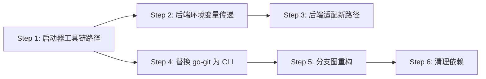

# 综合重构计划：工具链目录重组 + 替换 go-git + 分支图重构

## 1. 现状全景

### 当前目录结构

```
启动器目录/
├── launcher.exe
├── config.yaml
├── rg.exe                     ← ripgrep 放在 exe 同级
├── PortableGit-2.54.0.7z.exe ← git 安装包（按需下载）
├── qingzhu/                   ← 项目目录（既是代码仓库又是工具链存放地）
│   ├── bin/                   ← 工具链全在项目里！
│   │   ├── git/
│   │   │   └── bin/git.exe
│   │   ├── node/
│   │   │   ├── node.exe
│   │   │   ├── npm.cmd
│   │   │   └── npx.cmd
│   │   └── rg.exe
│   ├── .venv/                 ← 虚拟环境
│   ├── .git/                  ← git 仓库
│   ├── backend/
│   ├── frontend/
│   └── data/
```

### 当前工具链路径引用分布

| 位置 | 文件 | 当前路径逻辑 |
|------|------|-------------|
| 🔴 启动器 | [`env.go:25`](../launcher/internal/env/env.go:25) | `getBinDir(baseDir)` = `baseDir/bin` = `qingzhu/bin` |
| 🔴 启动器 | [`env.go:39`](../launcher/internal/env/env.go:39) | 检测 Node: `bin/node/node.exe` |
| 🔴 启动器 | [`updater.go:147`](../launcher/internal/updater/updater.go:147) | 解压 Git 到 `bin/git/` |
| 🔴 启动器 | [`updater.go:80`](../launcher/internal/updater/updater.go:80) | 复制 rg 到 `bin/rg.exe` |
| 🔴 启动器 | [`backend.go:59`](../launcher/internal/backend/backend.go:59) | 启动后端未传工具链路径环境变量 |
| 🔴 后端 | [`paths.py:21`](../backend/settings/paths.py:21) | `get_bin_dir()` = `项目根目录/bin` |
| 🔴 后端 | [`settings.py:62`](../backend/settings/settings.py:62) | 找 git/node/rg 都在 `bin/` 下 |

### 当前 go-git 使用点

| 文件 | 函数 | go-git API | 将替换为 |
|------|------|-----------|---------|
| [`gitman.go:35`](../launcher/internal/gitman/gitman.go:35) | `GetCommitHistory` | `repo.Log()` | `git log --all` |
| [`gitman.go:78`](../launcher/internal/gitman/gitman.go:78) | `FetchRemote` | `repo.Fetch()` | `git fetch --prune` |
| [`gitman.go:97`](../launcher/internal/gitman/gitman.go:97) | `SyncRemoteBranches` | 复杂分支同步 | `git fetch --prune` + `git branch` |
| [`gitman.go:185`](../launcher/internal/gitman/gitman.go:185) | `GetBranches` | `repo.Branches()` | `git branch --list` |
| [`gitman.go:221`](../launcher/internal/gitman/gitman.go:221) | `CheckoutCommit` | `w.Reset()` | `git reset --hard` |
| [`gitman.go:245`](../launcher/internal/gitman/gitman.go:245) | `SwitchBranch` | `w.Checkout()` | `git checkout` |
| [`gitman.go:300`](../launcher/internal/gitman/gitman.go:300) | `CreateBranch` | `repo.CreateBranch()` | `git branch` |
| [`gitman.go:331`](../launcher/internal/gitman/gitman.go:331) | `GetFullCommitGraph` | BFS 遍历 | `git log --graph --all` |
| [`updater.go:270`](../launcher/internal/updater/updater.go:270) | `GetRemoteLatestCommit` | `remote.List()` | `git ls-remote` |
| [`updater.go:311`](../launcher/internal/updater/updater.go:311) | `GetLocalCommit` | `repo.Head()` | `git rev-parse HEAD` |
| [`updater.go:331`](../launcher/internal/updater/updater.go:331) | `CheckUpdateStatus` | `repo.Head()` | `git rev-parse HEAD` |
| [`updater.go:477`](../launcher/internal/updater/updater.go:477) | `SyncBranchesFromRemote` | `repo.Fetch()` + `w.Reset()` | `git fetch --prune` + `git reset` |
| [`updater.go:522`](../launcher/internal/updater/updater.go:522) | `PullUpdates` | `PlainOpen` + `Fetch` + `Reset` | `git pull` / `git clone` |
| [`updater.go:581`](../launcher/internal/updater/updater.go:581) | `cloneProject` | `PlainClone` | `git clone` |
| [`gitservice.go:31`](../launcher/internal/gitservice/gitservice.go:31) | `openRepo` | `PlainOpen` | 改为 `git` CLI 调用 |
| [`gitservice.go:54`](../launcher/internal/gitservice/gitservice.go:54) | `GetStatus` | `w.Status()` | `git status` |
| [`gitservice.go:123`](../launcher/internal/gitservice/gitservice.go:123) | `ListCheckpoints` | `repo.Log()` | `git log` |
| [`gitservice.go:166`](../launcher/internal/gitservice/gitservice.go:166) | `SaveCheckpoint` | `w.AddWithOptions()` + `w.Commit()` | `git add -A` + `git commit` |
| [`gitservice.go:231`](../launcher/internal/gitservice/gitservice.go:231) | `RestoreCheckpoint` | `w.Reset()` | `git reset --hard` |
| [`gitservice.go:486`](../launcher/internal/gitservice/gitservice.go:486) | `InitRepo` | `PlainInit` + `w.Commit()` | `git init` + `git add` + `git commit` |

---

## 2. 目标目录结构

```
启动器目录/
├── launcher.exe
├── config.yaml
├── tools/                     ← 工具链从项目中移出
│   ├── git/
│   │   └── bin/git.exe        ← PortableGit
│   ├── node/
│   │   ├── node.exe
│   │   ├── npm.cmd
│   │   └── npx.cmd
│   ├── uv.exe                 ← (未来可加)
│   └── rg.exe
├── qingzhu/                   ← 纯粹的项目代码仓库
│   ├── .venv/                 ← 虚拟环境保留
│   ├── .git/
│   ├── backend/
│   ├── frontend/
│   └── data/
```

---

## 3. 实施步骤

### Step 1: 启动器工具链路径重构

**目标**：`getBinDir()` 从 `baseDir/bin` 改为 `exeDir/tools`

**涉及文件**：
- [`launcher/internal/env/env.go`](../launcher/internal/env/env.go)
- [`launcher/internal/updater/updater.go`](../launcher/internal/updater/updater.go)
- [`launcher/internal/launcher/launcher.go`](../launcher/internal/launcher/launcher.go)

**改动**：

```go
// env.go - 新增 getToolsDir
func getToolsDir() string {          // 不再需要 baseDir 参数！
    exePath, _ := os.Executable()
    return filepath.Join(filepath.Dir(exePath), "tools")
}

// env.go - DetectNode 改为查找 tools/node/node.exe
func DetectNode() (string, bool) {
    p := filepath.Join(getToolsDir(), "node", "node.exe")
    ...
}

// updater.go - EnsureGit 解压到 tools/git/
func EnsureGit(logger Logger) error {
    toolsDir := getToolsDir()
    dstDir := filepath.Join(toolsDir, "git")
    gitExe := filepath.Join(dstDir, "bin", "git.exe")
    ...
}

// updater.go - EnsureRipgrep 复制到 tools/
func EnsureRipgrep() error {
    toolsDir := getToolsDir()
    dst := filepath.Join(toolsDir, "rg.exe")
    ...
}
```

**注意**：`EnsureGit`、`EnsureRipgrep`、`DownloadNode` 等函数的参数可以从 `(projectDir string, ...)` 简化为 `(...)`，因为它们不再需要知道项目路径。

### Step 2: 后端启动时传递工具链路径

**目标**：启动器启动 Python 后端时，通过环境变量传递 `TOOLS_DIR`

**涉及文件**：
- [`launcher/internal/backend/backend.go`](../launcher/internal/backend/backend.go)

**改动**：

```go
// backend.go - Start 函数设置环境变量
func Start(projectPath, pythonPath string, logger Logger) (*exec.Cmd, error) {
    cmd := exec.Command(pythonPath, mainPy)
    cmd.Dir = projectPath
    cmd.Env = append(os.Environ(),
        "AI_NOVELIST_TOOLS_DIR="+getToolsDir(),
    )
    ...
}
```

### Step 3: 后端适配新工具链路径

**目标**：Python 后端读取环境变量 `AI_NOVELIST_TOOLS_DIR` 确定工具位置

**涉及文件**：
- [`backend/settings/paths.py`](../backend/settings/paths.py)
- [`backend/settings/settings.py`](../backend/settings/settings.py)

**改动**：

```python
# paths.py - get_bin_dir 优先读取环境变量
def get_bin_dir():
    tools_dir = os.environ.get("AI_NOVELIST_TOOLS_DIR")
    if tools_dir:
        return Path(tools_dir)
    # fallback: 旧逻辑（兼容开发环境）
    if getattr(sys, 'frozen', False):
        exe_dir = Path(sys.executable).parent
        return exe_dir / '_internal' / 'bin'
    return Path(__file__).parent.parent.parent / 'bin'
```

### Step 4: 移除 go-git 依赖，全部替换为本地 git CLI 调用

**目标**：`go.mod` 中移除 `github.com/go-git/go-git/v6`，所有 git 操作通过 `exec.Command(tools/git/bin/git.exe, ...)` 执行

**涉及文件**：
- [`launcher/internal/gitman/gitman.go`](../launcher/internal/gitman/gitman.go) — 全部重写
- [`launcher/internal/gitservice/gitservice.go`](../launcher/internal/gitservice/gitservice.go) — 全部重写
- [`launcher/internal/updater/updater.go`](../launcher/internal/updater/updater.go) — 替换 clone/fetch/status 等
- [`launcher/app.go`](../launcher/internal/updater/updater.go) — Git 绑定签名不变

**核心实现**：

```go
// 新增 gitutil.go - git CLI 封装
package gitutil

func GitExec(args ...string) (*exec.Cmd, error) {
    gitExe := filepath.Join(getToolsDir(), "git", "bin", "git.exe")
    if _, err := os.Stat(gitExe); err != nil {
        return nil, fmt.Errorf("git not found: %s", gitExe)
    }
    cmd := exec.Command(gitExe, args...)
    return cmd, nil
}

func GitExecIn(dir string, args ...string) (*exec.Cmd, error) {
    cmd, err := GitExec(args...)
    if err != nil { return nil, err }
    cmd.Dir = dir
    return cmd, nil
}

func GitOutput(dir string, args ...string) (string, error) {
    cmd, err := GitExecIn(dir, args...)
    if err != nil { return "", err }
    out, err := cmd.Output()
    return strings.TrimSpace(string(out)), err
}
```

**替换对照表**：

| go-git 操作 | 替换为 git CLI |
|------------|---------------|
| `repo.Log()` | `git log --all --format="%H|%P|%s|%an|%aI|%D" -n <limit>` |
| `repo.Branches()` | `git branch --format="%(refname:short)|%(objectname)"` |
| `worktree.Checkout()` | `git checkout <branch>` |
| `worktree.Reset()` | `git reset --hard <hash>` |
| `repo.CreateBranch()` | `git branch <name>` |
| `repo.Fetch()` | `git fetch --prune origin` |
| `PlainClone()` | `git clone <url> <dir>` |
| `remote.List()` | `git ls-remote <url> <branch>` |
| `repo.Head()` | `git rev-parse HEAD` |
| `worktree.Status()` | `git status --porcelain` |
| `worktree.AddWithOptions()` | `git add -A` |
| `worktree.Commit()` | `git commit -m <msg>` |
| `PlainInit()` | `git init` |

### Step 5: 重构分支图功能

**目标**：调用 `git log --graph --all --format="%H%x1F%P%x1F%s%x1F%an%x1F%aI%x1F%D"` 解析输出，前端 monospace 渲染

**后端**：在 [`gitman.go`](../launcher/internal/gitman/gitman.go) 新增：

```go
type GraphLine struct {
    Graph    string `json:"graph"`
    Hash     string `json:"hash"`
    Parents  string `json:"parents"`
    Message  string `json:"message"`
    Author   string `json:"author"`
    Date     string `json:"date"`
    Refs     string `json:"refs"`
    IsCommit bool   `json:"is_commit"`
}

func GetGraphOutput(projectDir string, maxCount int) ([]GraphLine, error) {
    // 使用 git CLI 调用 git log --graph --all
    out, err := GitOutput(projectDir,
        "log", "--graph", "--all",
        fmt.Sprintf("--format=%s", graphFormat),
        fmt.Sprintf("--max-count=%d", maxCount),
    )
    // 解析每行
    // 含 \x1F → commit 行，不含 → 连接线行
}
```

**前端**：修改 [`GitManager.tsx`](../launcher/frontend/src/components/GitManager.tsx)：
- 移除 `@gitgraph/react` 依赖
- 替换 `GitGraphView` 为 `GraphAsciiView`
- 用 `<pre>` + 颜色高亮渲染

### Step 6: 清理 go-git 依赖和 `@gitgraph/react`

**文件**：
- [`launcher/go.mod`](../launcher/go.mod) — 移除 `github.com/go-git/go-git/v6`
- [`launcher/frontend/package.json`](../launcher/frontend/package.json) — 移除 `@gitgraph/core`、`@gitgraph/react`

---

## 4. 风险与注意事项

1. **git CLI 可用性**：`EnsureGit()` 在"准备环境"阶段执行，如果用户没点"准备环境"就直接点启动，git 可能不可用。→ `BackendStart`/`FrontendStart` 前需确保 `EnsureGit` 已执行。
2. **`.venv` 路径不变**：虚拟环境仍放在项目内，不移动。
3. **前端开发环境**：`vite dev` 时 Python 后端路径逻辑是 `Path(__file__).parent.parent.parent / 'bin'`（项目根目录）。如果没有环境变量，fallback 到旧路径。
4. **跨平台**：`git.exe` 是 Windows 路径，Linux/macOS 需要适配。

---

## 5. 实施顺序



实际执行时，Step 1-3 可以并行推进，Step 4 是最大的改动，Step 5 依赖 Step 4 完成。
